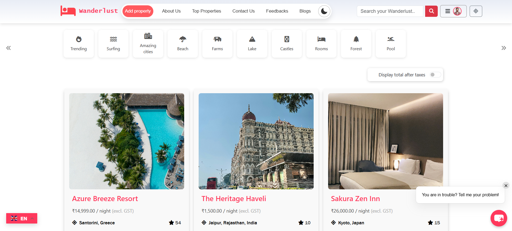
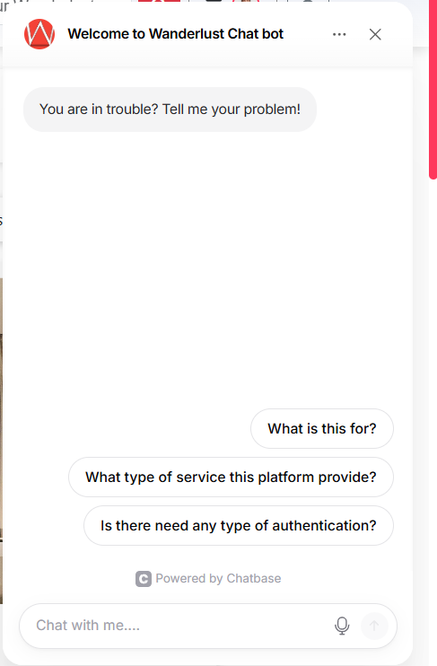

<div align="center">

# Wanderlust - Travel Listing & Booking Platform

[](https://nodejs.org/)
[](https://expressjs.com/)
[](https://www.mongodb.com/)
[](https://ejs.co/)
[](https://getbootstrap.com/)
[](https://cloudinary.com/)
[](https://nodemailer.com/)

**A comprehensive, production-ready travel listing and booking platform featuring secure user authentication, dynamic property management, real-time feedback systems, and cloud-based media hosting.**

[**Live Demo**](https://wanderlust-travel-app.onrender.com) || [**Portfolio**](https://raghavverma.vercel.app/)

</div>

---

## 📋 Table of Contents
- [Features](#-features)
- [Tech Stack](#-tech-stack)
- [Project Structure](#-project-structure)
- [Getting Started](#-getting-started)
- [Environment Variables](#-environment-variables)
- [Screenshots](#-screenshots)
- [Deployment](#-deployment)
- [Contributing](#-contributing)
- [Roadmap](#-roadmap)

---

## ✨ Features

- **Public Access**: Browse, search, and view listing details; explore blog pages and contact form
- **User Management**: Sign up/login, update profile, create and manage bookings, leave feedback and reviews
- **Admin Dashboard**: Create/update/delete listings, manage users and bookings, moderate feedback
- **Media Handling**: Images stored and optimized on Cloudinary
- **Email Notifications**: SMTP-based password reset and contact responses
- **Error Handling**: Centralized error utilities with user-friendly error pages

---

## 🛠️ Tech Stack

| Component | Technology |
|-----------|-----------|
| **Runtime** | Node.js |
| **Framework** | Express.js |
| **Database** | MongoDB Atlas + Mongoose ODM |
| **View Engine** | EJS (Embedded JavaScript) |
| **Styling** | Bootstrap 5 + Custom CSS3 |
| **Media Hosting** | Cloudinary |
| **Email Service** | Nodemailer (SMTP) |

---

## 📁 Project Structure

```
wanderlust/
├── app.js                 # Main Express application entry
├── admin.js               # Admin routes
├── controllers/           # Request handlers (listings, users, bookings, etc.)
├── models/                # Mongoose schemas
├── views/                 # EJS templates and layouts
│   ├── includes/          # Partials
│   └── layouts/           # Layout templates
├── public/                # Static assets (CSS, JS, images)
├── utils/                 # Helper utilities
├── middlewares/           # Custom middleware
├── .env.example           # Environment variables template
└── package.json
```

---

## 🚀 Getting Started

### Prerequisites
- Node.js (v14 or higher)
- MongoDB Atlas account
- Cloudinary account
- SMTP credentials (Gmail or similar)

### Installation

1. **Clone the repository:**
```bash
git clone <repo-url> wanderlust
cd wanderlust
```

2. **Install dependencies:**
```bash
npm install
```

3. **Set up environment variables:**
```bash
cp .env.example .env
```
Edit `.env` and fill in the required values (see [Environment Variables](#-environment-variables)).

4. **Start the application:**

Development mode (with auto-reload):
```bash
npm run dev
```

Production mode:
```bash
node app.js
```

5. **Access the application:**
Open your browser to `http://localhost:8080`

---

## 🔐 Environment Variables

Create a `.env` file in the root directory (do not commit). Required variables:

```env
ATLAS_DB_TOKEN=your_mongodb_atlas_connection_string
SECRET=your_session_secret
CLOUD_NAME=your_cloudinary_cloud_name
CLOUD_API_KEY=your_cloudinary_api_key
CLOUD_API_SECRET=your_cloudinary_api_secret
PORT=8080
MAIL_HOST=smtp.gmail.com
MAIL_USER=your_email@gmail.com
MAIL_PASS=your_app_password
ADMIN_EMAIL=admin@example.com
```

**Note:** Keep all secrets out of version control. Use `.env.example` as a reference template.

---

## 📸 Screenshots

### Home Page
*Browse and search travel listings with an intuitive interface*


### Chat Bot Support
*AI-powered assistant for instant customer support*


### Blog Page
*Informative travel guides and destination tips*


### Admin Panel
*Comprehensive dashboard for managing listings, users, and bookings*


---

## 🌐 Deployment

1. Provision a Node-compatible host (Render, Railway, Heroku, DigitalOcean, etc.)
2. Configure environment variables on the hosting platform
3. Ensure MongoDB Atlas allows your host IP or uses SRV connection
4. Set build/start commands as required by your host
5. Verify Cloudinary and email credentials for production
6. Optional: Configure HTTPS/SSL and use PM2 for process management

---

## 🧪 Testing

Automated tests are not included by default. Consider adding:
- **Jest** for unit testing
- **Mocha + Supertest** for route and controller testing

---

## 🤝 Contributing

1. Fork the repository
2. Create a feature branch (`git checkout -b feature/your-feature`)
3. Commit your changes (`git commit -m 'Add feature'`)
4. Push to the branch (`git push origin feature/your-feature`)
5. Open a pull request

Follow existing code style for controllers, models, and EJS templates. Include before/after screenshots for UI changes.

---

## 🔒 Security & Privacy

- Never commit `.env` or sensitive credentials
- Rotate SMTP and Cloudinary keys if exposed
- Validate all user inputs server-side
- Use HTTPS in production

---

## 🗺️ Roadmap

- [ ] Payment Integration: Stripe for booking transactions
- [ ] Real-time Chat: Socket.io for guest-to-host communication
- [ ] Geospatial Search: MongoDB $near queries for location-based listings
- [ ] Advanced Notifications: SMS alerts and push notifications
- [ ] Review System: Star ratings with photo galleries

---

## 📞 Support & Contact

For bugs, feature requests, or support, please open an issue in the repository. For urgent matters, contact the admin email configured in `.env`.

---


